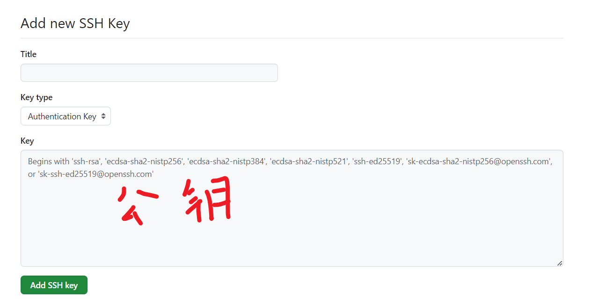

粗糙，仅留档供个人使用
记录一下部署用到的工具以及踩过的坑

项目:

1. 前端： javascript、react、vite
2. 后端： node
3. typescript

当然不止这些，不过其他框架、工具之类的，不记也罢

# 大致流程

1. 购买一台服务器
2. 配置环境
3. 把项目放到服务器上(是否打包看个人情况)
4. 运行

其中购买服务器暂且按下不表

# 配置环境

## 安装node环境和npm (配套镜像)

此处使用nvm
node version manager (node 版本管理工具)

github网址：https://github.com/nvm-sh/nvm

### 安装nvm

```
curl -o- https://raw.githubusercontent.com/nvm-sh/nvm/v0.40.1/install.sh | bash

# or

wget -qO- https://raw.githubusercontent.com/nvm-sh/nvm/v0.40.1/install.sh | bash
```

### 使用镜像

如果安装nvm太慢,可以使用淘宝镜像

```
export NVM_NODEJS_ORG_MIRROR=https://npmmirror.com/mirrors/node
curl -o- https://npmmirror.com/mirrors/nvm/install.sh | bash

```

### 激活

安装完成后，运行以下命令来加载 NVM：

```bash
source ~/.bashrc

如果是Zsh
source ~/.zshrc
```

或者运行

```
export NVM_DIR="$([ -z "${XDG_CONFIG_HOME-}" ] && printf %s "${HOME}/.nvm" || printf %s "${XDG_CONFIG_HOME}/nvm")"
  [ -s "$NVM_DIR/nvm.sh" ] && \. "$NVM_DIR/nvm.sh" # This loads nvm
```

第一行设置了一个环境变量 $NVM_DIR，它指向 NVM 的安装目录。
第二行检查 $NVM_DIR/nvm.sh 文件是否存在，如果存在，就执行它。这一步是加载 NVM 的必要步骤。

确保 NVM 正确安装，您可以运行以下命令检查 NVM 版本：

```bash
nvm --version
```

### 安装Node.js

使用 NVM 安装 Node.js

```bash
nvm install --lts

node --version
```

如果想安装或切换到其他版本的 Node.js，可以运行：

```bash
nvm install <version>
nvm use <version>
```

例如，安装并使用 Node.js 16：

```bash
nvm install 16
nvm use 16
```

### npm镜像

在安装npm 包的时候可能会比较慢，配置国内镜像

腾讯云镜像源
npm config set registry http://mirrors.cloud.tencent.com/npm/

淘宝镜像源
npm config set registry https://registry.npmmirror.com

华为云镜像源
npm config set registry https://mirrors.huaweicloud.com/repository/npm/

## 配置Git

### 安装git

```
sudo apt update

sudo apt install git

git --version
```

### 配置SSH

```
ssh-keygen -t rsa -C "youremail@example.com" -b 4096
```

其中
-t 是加密方式
-C 是常用的email标识号(亲测配不配email似乎没用)
-b 生成的密钥大小，不配也行

```
//查看私钥
cat ~/.ssh/id_rsa

// 查看公钥
cat ~/.ssh/id_rsa.pub
```

查看并复制公钥
打开github的setting




之后就可以使用ssh拉取代码啦

```
git clone xxxx
```

# 部署

推荐一个工具:**finalshell**

图形化ssh、fcp协议

## 不打包部署

这一部分比较简单

首先通过git拉取对应的文件
以下是我的文件夹
--back_end
|_front_end

其中
back_end是后端node程序，通过npm start启动，
front_end是vite，通过npm run dev启动

小tips:
通过package.json脚本可以一键启动多个程序

```json
{
  "devDependencies": {
    "concurrently": "^8.2.2"
  },
  "scripts": {
    "start-all": "concurrently \"npm start --prefix back_end\" \"npm run dev --prefix front_end\" "
  }
}
```

--prefix： 在当前文件夹的某个目录运行

之后在根目录运行即可

```
npm run start-all

```

## 打包部署

# 重要问题

## 大小写敏感问题

windows系统对于文件路径和文件名大小写是**不敏感的**

比如 import 路径
./Test/photo.tsx
和 实际路径
./test/Photo.tsx

在window系统上，如果你开发的时候把test目录改成了Test目录
git是**不会识别**到更改的

但是linux在上面的导入中，会报错

window启用大小写敏感：

```
fsutil file setCaseSensitiveInfo "C:\your\folder\path" enable
```

把"C:\your\folder\path" 替换为你的文件目录名
不过只能对空目录用，先把文件转移除去，设置之后再放回来

## Linux进程相关（如何保活后台应用 ?）

在linux中，有下面几个概念：

概念 描述
**进程组**：一个或多个进程的集合，每一个进程组都有唯一一个进程组ID，即进程组
**会话器**：一个或多个进程组的集合，有唯一一个会话期首进程（session leader）. 会话期ID为首进程的ID
控制进程:与控制终端连接的会话期首进程叫做控制进程

当用户登录到一个终端时，系统会为这个登录会话创建一个**会话（session**）。从用户登录到退出的整个过程中，所有在这个终端上运行的进程都属于同一个会话。


### 进程和进程组：

每个进程都有一个独立的进程ID（PID），但它们还归属于一个更大的组织单位，称为
进程组。一个进程组可以包含多个进程，并且有一个唯一的进程组ID。进程组允许多个进程一起执行操作，比如使用管道符号 “|” 连接的命令。

### 会话和会话首进程：

一个 会话 包含一个或多个进程组。每个会话都有一个唯一的领导者进程，称为 **会话首进程，并且它的ID就是会话的ID**。

### 控制进程和控制终端：

当一个会话与一个终端（如SSH连接的终端）关联时，负责与这个终端通信的进程就是
控制进程，它通常是会话首进程。当终端检测到网络断开时，会向控制进程发送一个挂断信号（SIGHUP）。

### 挂断信号的传播：

如果控制进程收到SIGHUP信号并退出，会话中的所有前台进程组也会受到影响并终止。如果某个进程组中的进程已经停止，系统还会发送SIGHUP和SIGCONT信号，尝试重新启动它们。

最后:
当SSH会话断开时，系统会给控制进程发送一个SIGHUP信号，导致整个会话中的进程都被终止。这就是为什么当SSH连接关闭后，正在执行的任务也会随之取消。
简而言之，SSH会话打开时运行的所有命令和进程（如bash）**都是它的子进程**。一旦SSH连接断开，系统会终止所有相关进程，导致未完成的任务被取消。
